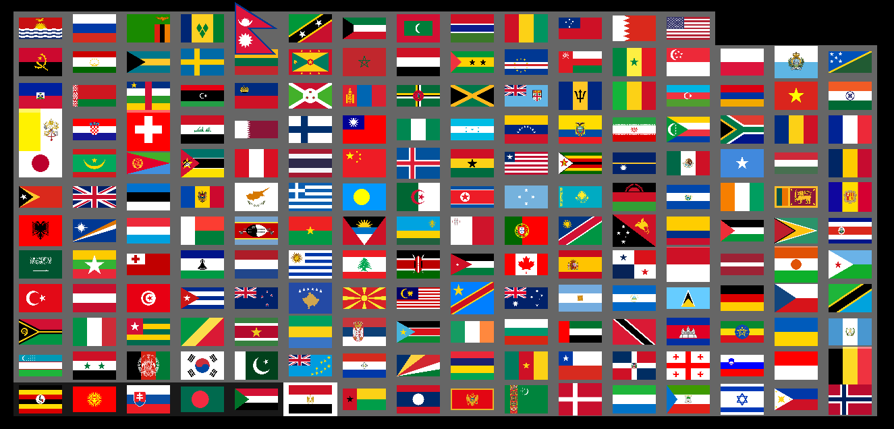

# world flags

This is a desktop version of [sporcle worldflags](https://www.sporcle.com/games/g/worldflags) done with haskell gloss. Check Bmp.hs for allowable spellings.

When you `cabal run` this, you get the window below. The white background moves left to right, bottom to top whenever the last characters typed match one of the country's names. Unlike the sporcle version, you don't have to backspace on making a mistake. When you finish the game, `log.csv` includes tested cards and mistakes.

## TODO

- [ ] pagination
- [ ] ncol is currently hardcoded but it could be based on the ViewPort
- [ ] some flags like Nepal or Switzerland are a little too big
- [ ] add `bmp/*` to cabal data files, such that a cabal-install'd version can find the flags
- [ ] display typed text
- [ ] disambiguate Romania and Chad
- [ ] log the total time, times for each country, ms between each character
- [ ] allow skipping forward / giving the solution after a certain number of mistakes
- [ ] non-random order: two flags right after eachother may lead to more mistakes than if they were separated. Two flags right after eachother may take longer than if they were separated. Mistakes and duration are connected.
